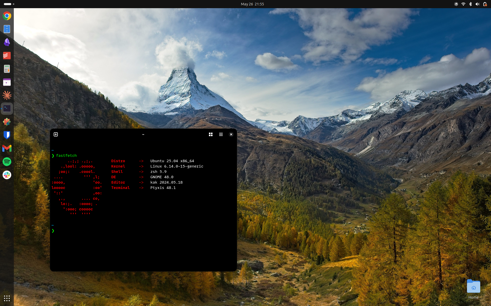

# falk's dotfiles



- **OS**: Ubuntu 25.04
- **DE**: GNOME 48
- **Shell**: zsh
- **Text Editor**: Kakoune

# Installation
I use GNU Stow to symlink my dotfiles to the home directory. In order to apply my configuration, cd into the repository and execute the following command:

```sh
stow -t ~ .
```

Voilà!
